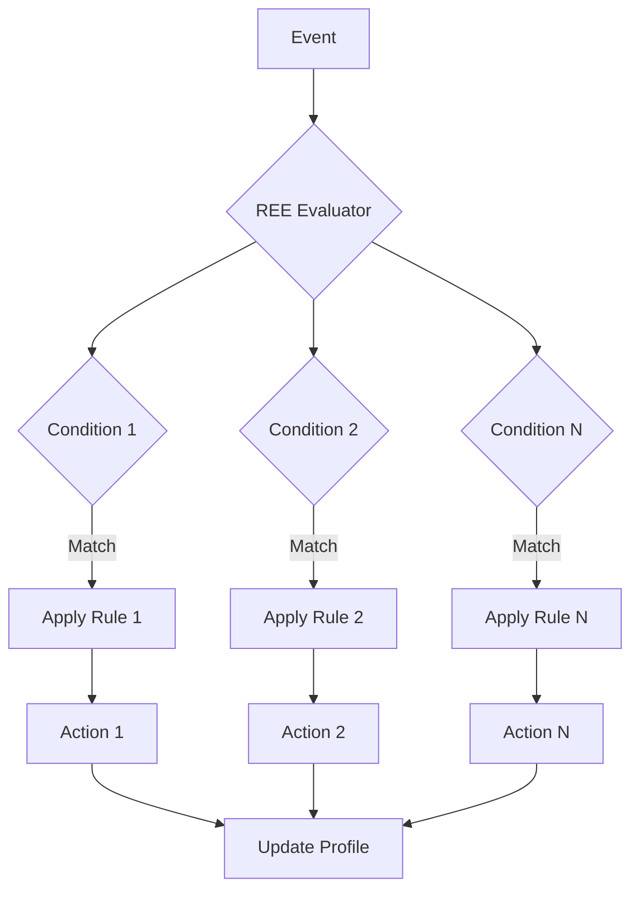

# REE Decision Catalog

The Real-time Event Engine (REE) evaluates conditions against incoming events and triggers actions based on configurable rules.

---

## Overview



### Rule Structure

```typescript
interface REERule {
  id: string;
  name: string;
  description: string;
  priority: 'critical' | 'high' | 'medium' | 'low';
  enabled: boolean;

  // Trigger conditions
  trigger: {
    eventType: string[];  // Events that can trigger this rule
    conditions: Condition[];
  };

  // Actions to execute
  actions: Action[];

  // Constraints
  constraints: {
    maxExecutionsPerUser?: number;
    maxExecutionsTotal?: number;
    timeWindow?: string;  // e.g., "1d", "7d"
    cooldown?: string;    // e.g., "24h"
  };

  // Targeting
  targeting?: {
    segments?: string[];
    tiers?: string[];
    minOrders?: number;
    maxOrders?: number;
    minLifetimeValue?: number;
  };
}

interface Condition {
  field: string;           // e.g., "data.order.total"
  operator: 'eq' | 'ne' | 'gt' | 'gte' | 'lt' | 'lte' | 'in' | 'not_in' | 'contains' | 'exists';
  value: unknown;
  logicalOperator?: 'and' | 'or';
}

interface Action {
  type: string;
  params: Record<string, unknown>;
}
```

---

## Loyalty Decision Rules

### Rule: NEW_USER_FIRST_ORDER

Awards bonus points for first order.

```typescript
{
  id: "loyalty_new_user_first_order",
  name: "New User First Order Bonus",
  description: "Credit 100 bonus points for user's first order over Rs. 500",
  priority: "high",
  enabled: true,

  trigger: {
    eventType: ["order.delivered"],
    conditions: [
      { field: "data.user.totalOrders", operator: "eq", value: 1 },
      { field: "data.totals.total", operator: "gte", value: 500 }
    ]
  },

  actions: [
    {
      type: "loyalty.credit_points",
      params: { points: 100, reason: "First order bonus" }
    }
  ],

  targeting: {
    minOrders: 0,
    maxOrders: 1
  }
}
```

**Input Schema:**
```typescript
interface NewUserFirstOrderInput {
  event: OrderDeliveredEvent;
  user: UnifiedUserProfile;
}
```

**Output Schema:**
```typescript
interface NewUserFirstOrderOutput {
  pointsAwarded: number;
  newBalance: number;
  bonusReason: string;
}
```

**Example:**
```json
{
  "input": {
    "event": {
      "data": {
        "orderId": "ord_123",
        "userId": "user_456",
        "totals": { "total": 750 }
      }
    },
    "user": {
      "userId": "user_456",
      "commerce": { "totalOrders": 1 }
    }
  },
  "output": {
    "pointsAwarded": 100,
    "newBalance": 2100,
    "bonusReason": "First order bonus"
  }
}
```

---

### Rule: TIER_UPGRADE_THRESHOLD

Automatically upgrades tier when threshold is met.

```typescript
{
  id: "loyalty_tier_upgrade",
  name: "Tier Upgrade",
  description: "Upgrade tier when lifetime points threshold is reached",
  priority: "critical",
  enabled: true,

  trigger: {
    eventType: ["loyalty.points.earned"],
    conditions: []
  },

  actions: [
    {
      type: "loyalty.upgrade_tier",
      params: {}
    }
  ],

  targeting: {
    segments: ["bronze", "silver", "gold"]
  }
}
```

**Tier Thresholds:**

| Current Tier | Next Tier | Lifetime Points Required |
|--------------|-----------|------------------------|
| Bronze | Silver | 5,000 |
| Silver | Gold | 20,000 |
| Gold | Platinum | 50,000 |

---

### Rule: MILESTONE_CHECK

Checks and awards milestone bonuses.

```typescript
{
  id: "loyalty_milestone_check",
  name: "Milestone Bonus",
  description: "Award bonus when user reaches order milestones",
  priority: "medium",
  enabled: true,

  trigger: {
    eventType: ["order.delivered"],
    conditions: []
  },

  actions: [
    {
      type: "loyalty.check_milestone",
      params: {
        milestones: [10, 25, 50, 100, 250, 500, 1000]
      }
    }
  ]
}
```

**Milestone Rewards:**

| Orders | Points Bonus | Cashback Boost |
|--------|--------------|----------------|
| 10 | 100 | - |
| 25 | 250 | 1% |
| 50 | 500 | 2% |
| 100 | 1,000 | 3% |
| 250 | 3,000 | 5% |
| 500 | 7,500 | 7% |
| 1,000 | 20,000 | 10% |

---

### Rule: POINTS_EXPIRY_WARNING

Sends warning when points are about to expire.

```typescript
{
  id: "loyalty_points_expiry_warning",
  name: "Points Expiry Warning",
  description: "Notify users 30 days before points expire",
  priority: "medium",
  enabled: true,

  trigger: {
    eventType: ["schedule.daily"],
    conditions: [
      { field: "user.loyalty.expiringPoints", operator: "gt", value: 100 }
    ]
  },

  actions: [
    {
      type: "notification.send",
      params: {
        channel: "push",
        template: "points_expiry_warning",
        priority: "medium"
      }
    }
  ],

  constraints: {
    maxExecutionsPerUser: 2,
    timeWindow: "30d"
  }
}
```

---

### Rule: LOW_POINTS_BALANCE_REMINDER

Reminds users to use their points.

```typescript
{
  id: "loyalty_low_points_reminder",
  name: "Low Points Balance Reminder",
  description: "Send reminder when balance is below 100 points after 30 days",
  priority: "low",
  enabled: true,

  trigger: {
    eventType: ["schedule.daily"],
    conditions: [
      { field: "user.loyalty.points", operator: "lt", value: 100 },
      { field: "user.engagement.lastRedemption", operator: "not_in", value: null }
    ]
  },

  actions: [
    {
      type: "notification.send",
      params: {
        channel: "push",
        template: "low_points_reminder",
        priority: "low"
      }
    }
  ],

  constraints: {
    timeWindow: "30d",
    cooldown: "7d"
  }
}
```

---

## Cashback Decision Rules

### Rule: CASHBACK_CALCULATION

Calculates cashback based on tier and order value.

```typescript
{
  id: "cashback_calculation",
  name: "Calculate Cashback",
  description: "Credit cashback based on tier multiplier and order value",
  priority: "critical",
  enabled: true,

  trigger: {
    eventType: ["order.delivered"],
    conditions: []
  },

  actions: [
    {
      type: "cashback.calculate",
      params: {
        baseRate: 0.01  // 1%
      }
    }
  ]
}
```

**Tier Multipliers:**

| Tier | Cashback Rate |
|------|---------------|
| Bronze | 1% (base) |
| Silver | 1.25% |
| Gold | 1.5% |
| Platinum | 2% |

**Example Calculation:**
- Order total: Rs. 1,000
- User tier: Gold
- Cashback: 1,000 x 1.5% = Rs. 15

---

### Rule: CASHBACK_BOOST_STREAK

Applies streak-based cashback boost.

```typescript
{
  id: "cashback_streak_boost",
  name: "Streak Cashback Boost",
  description: "Apply additional cashback for active streaks",
  priority: "medium",
  enabled: true,

  trigger: {
    eventType: ["order.delivered"],
    conditions: [
      { field: "user.gamification.streakDays", operator: "gte", value: 7 }
    ]
  },

  actions: [
    {
      type: "cashback.apply_boost",
      params: {
        condition: "streak_7_days",
        boostPercent: 1
      }
    }
  ]
}
```

**Streak Boosts:**

| Streak Days | Cashback Boost |
|-------------|----------------|
| 7+ | +1% |
| 14+ | +2% |
| 30+ | +3% |
| 60+ | +5% |

---

## Gamification Decision Rules

### Rule: KARMA_ON_REVIEW

Awards karma for leaving reviews.

```typescript
{
  id: "karma_review",
  name: "Review Karma",
  description: "Award karma points for verified reviews",
  priority: "medium",
  enabled: true,

  trigger: {
    eventType: ["review.submitted"],
    conditions: [
      { field: "data.verified", operator: "eq", value: true }
    ]
  },

  actions: [
    {
      type: "karma.award",
      params: {
        basePoints: 10,
        multipliers: {
          hasPhotos: 2,
          hasVideo: 3,
          lengthOver100Chars: 1.5
        }
      }
    }
  ]
}
```

**Karma Awards:**

| Review Type | Karma Points |
|-------------|--------------|
| Text only | 10 |
| With photos | 20 |
| With video | 30 |
| Long review (100+ chars) | +5 bonus |

---

### Rule: STREAK_UPDATE

Updates and checks streak milestones.

```typescript
{
  id: "streak_update",
  name: "Update Streak",
  description: "Update streak counter and check for milestones",
  priority: "high",
  enabled: true,

  trigger: {
    eventType: ["engagement.daily_action"],
    conditions: []
  },

  actions: [
    {
      type: "streak.increment",
      params: {}
    },
    {
      type: "streak.check_milestone",
      params: {
        milestones: [7, 14, 30, 60, 100, 200, 365]
      }
    }
  ]
}
```

---

### Rule: ACHIEVEMENT_CHECK

Checks and awards achievements.

```typescript
{
  id: "achievement_check",
  name: "Achievement Check",
  description: "Check if user has unlocked any achievements",
  priority: "medium",
  enabled: true,

  trigger: {
    eventType: ["order.delivered", "streak.continued", "review.submitted"],
    conditions: []
  },

  actions: [
    {
      type: "gamification.check_achievements",
      params: {}
    }
  ]
}
```

---

## Targeting Decision Rules

### Rule: SEGMENT_NEW_USER

Segments newly registered users.

```typescript
{
  id: "segment_new_user",
  name: "New User Segmentation",
  description: "Assign new users to appropriate segments",
  priority: "high",
  enabled: true,

  trigger: {
    eventType: ["user.created"],
    conditions: []
  },

  actions: [
    {
      type: "segment.assign",
      params: {
        segments: ["new_user"]
      }
    },
    {
      type: "segment.assign",
      params: {
        conditions: [
          { field: "data.source", operator: "eq", value: "referral" }
        ],
        segments: ["referral"]
      }
    }
  ]
}
```

---

### Rule: SEGMENT_HIGH_VALUE

Identifies high-value customers.

```typescript
{
  id: "segment_high_value",
  name: "High Value Customer",
  description: "Segment customers with high lifetime value",
  priority: "high",
  enabled: true,

  trigger: {
    eventType: ["order.delivered"],
    conditions: [
      { field: "user.commerce.lifetimeValue", operator: "gte", value: 50000 }
    ]
  },

  actions: [
    {
      type: "segment.assign",
      params: {
        segments: ["high_value", "vip"]
      }
    }
  ],

  targeting: {
    segments: ["new_user", "regular"]
  }
}
```

---

### Rule: SEGMENT_AT_RISK

Identifies at-risk customers for retention.

```typescript
{
  id: "segment_at_risk",
  name: "At-Risk Customer",
  description: "Identify customers at risk of churning",
  priority: "critical",
  enabled: true,

  trigger: {
    eventType: ["schedule.daily"],
    conditions: [
      { field: "user.behavioral.churnRisk", operator: "eq", value: "high" }
    ]
  },

  actions: [
    {
      type: "segment.assign",
      params: {
        segments: ["at_risk"]
      }
    },
    {
      type: "notification.send",
      params: {
        channel: "push",
        template: "retention_offer",
        priority: "high"
      }
    }
  ]
}
```

---

### Rule: SEGMENT_DORMANT

Identifies dormant customers.

```typescript
{
  id: "segment_dormant",
  name: "Dormant Customer",
  description: "Identify customers with no activity for 30+ days",
  priority: "high",
  enabled: true,

  trigger: {
    eventType: ["schedule.daily"],
    conditions: [
      { field: "user.engagement.lastActiveAt", operator: "lt", value: "30d_ago" }
    ]
  },

  actions: [
    {
      type: "segment.assign",
      params: {
        segments: ["dormant"]
      }
    }
  ]
}
```

---

## Nudge Decision Rules

### Rule: NUDGE_REVIVAL_SCARCE

Sends urgency nudge for scarcity-based revival.

```typescript
{
  id: "nudge_scarcity_revival",
  name: "Scarcity Revival Nudge",
  description: "Send urgency nudge when product is running low",
  priority: "high",
  enabled: true,

  trigger: {
    eventType: ["inventory.low"],
    conditions: [
      { field: "data.supplyCount", operator: "lte", value: 10 }
    ]
  },

  actions: [
    {
      type: "notification.send",
      params: {
        channel: "push",
        template: "scarcity_urgency",
        priority: "high"
      }
    }
  ],

  targeting: {
    segments: ["interested"]
  }
}
```

---

### Rule: NUDGE_REVIEW_REQUEST

Requests review after order delivery.

```typescript
{
  id: "nudge_review_request",
  name: "Review Request",
  description: "Send review request 24 hours after delivery",
  priority: "medium",
  enabled: true,

  trigger: {
    eventType: ["schedule.daily"],
    conditions: []
  },

  actions: [
    {
      type: "notification.send",
      params: {
        channel: "push",
        template: "review_request",
        delay: "24h",
        priority: "low"
      }
    }
  ],

  targeting: {
    segments: ["recent_customer"],
    constraints: {
      maxExecutionsPerUser: 1,
      timeWindow: "7d"
    }
  }
}
```

---

### Rule: NUDGE_ABANDONED_CART

Sends reminder for abandoned cart.

```typescript
{
  id: "nudge_abandoned_cart",
  name: "Abandoned Cart Reminder",
  description: "Send reminder for abandoned cart at 1h, 6h, 24h",
  priority: "high",
  enabled: true,

  trigger: {
    eventType: ["cart.abandoned"],
    conditions: []
  },

  actions: [
    {
      type: "notification.send",
      params: {
        channel: "push",
        template: "cart_reminder",
        delay: "1h",
        priority: "medium"
      }
    },
    {
      type: "notification.send",
      params: {
        channel: "email",
        template: "cart_reminder_email",
        delay: "6h",
        priority: "medium"
      }
    },
    {
      type: "notification.send",
      params: {
        channel: "sms",
        template: "cart_reminder_sms",
        delay: "24h",
        priority: "low"
      }
    }
  ],

  constraints: {
    maxExecutionsPerUser: 3,
    timeWindow: "7d"
  }
}
```

---

### Rule: FREQUENCY_CAPPING

Enforces frequency capping for nudges.

```typescript
{
  id: "frequency_capping",
  name: "Frequency Capping",
  description: "Limit nudges per user per day",
  priority: "critical",
  enabled: true,

  trigger: {
    eventType: ["nudge.queued"],
    conditions: []
  },

  actions: [
    {
      type: "frequency.check",
      params: {
        limit: 5,
        window: "1d"
      }
    }
  ],

  constraints: {
    maxExecutionsPerUser: 5,
    timeWindow: "1d"
  }
}
```

---

## Decision Quick Reference

| Rule ID | Name | Priority | Trigger | Action |
|---------|------|----------|---------|--------|
| `loyalty_new_user_first_order` | First Order Bonus | High | order.delivered | Credit 100 points |
| `loyalty_tier_upgrade` | Tier Upgrade | Critical | loyalty.points.earned | Upgrade tier |
| `loyalty_milestone_check` | Milestone Check | Medium | order.delivered | Award milestone |
| `loyalty_points_expiry_warning` | Expiry Warning | Medium | schedule.daily | Send notification |
| `cashback_calculation` | Cashback | Critical | order.delivered | Calculate cashback |
| `cashback_streak_boost` | Streak Boost | Medium | order.delivered | Apply boost |
| `karma_review` | Review Karma | Medium | review.submitted | Award karma |
| `streak_update` | Streak Update | High | engagement.daily_action | Increment streak |
| `achievement_check` | Achievement | Medium | Various | Check achievements |
| `segment_new_user` | New User Segment | High | user.created | Assign segment |
| `segment_high_value` | High Value | High | order.delivered | Assign segments |
| `segment_at_risk` | At-Risk | Critical | schedule.daily | Assign segment |
| `nudge_scarcity_revival` | Scarcity Nudge | High | inventory.low | Send nudge |
| `nudge_review_request` | Review Request | Medium | schedule.daily | Send nudge |
| `nudge_abandoned_cart` | Cart Reminder | High | cart.abandoned | Send sequence |
| `frequency_capping` | Frequency Cap | Critical | nudge.queued | Enforce limit |

---

## Business Metrics

### Loyalty Program Metrics

| Metric | Target | Calculation |
|--------|--------|------------|
| Members | 100,000+ | Count unique users |
| Active Members | 60%+ | Active in last 30 days |
| Tier Distribution | - | Count by tier |
| Points Issued | - | Sum of points.earned |
| Points Redeemed | 40%+ | Redeemed / Issued ratio |
| Avg Points Balance | 500+ | Total balance / members |

### Cashback Metrics

| Metric | Target | Calculation |
|--------|--------|------------|
| Cashback Rate | 1.5%+ | Total cashback / GMV |
| Redemption Rate | 50%+ | Redeemed / Earned |
| Avg Cashback | Rs. 25+ | Total / transactions |

### Engagement Metrics

| Metric | Target | Calculation |
|--------|--------|------------|
| Nudge Open Rate | 20%+ | Opens / Sent |
| Nudge CTR | 5%+ | Clicks / Sent |
| Conversion Rate | 2%+ | Conversions / Clicks |
| Streak Rate | 40%+ | Active streaks / total |

---

*For event schemas, see [EVENTS.md](EVENTS.md)*
*For API documentation, see [API_REFERENCE.md](API_REFERENCE.md)*
