# Integration Guide

This guide explains how each service connects and integrates within the REZ Loyalty System.

---

## Service Connections

### Order → Everything

The Order Service is the central event publisher. Every order completion triggers a cascade of loyalty and engagement events.

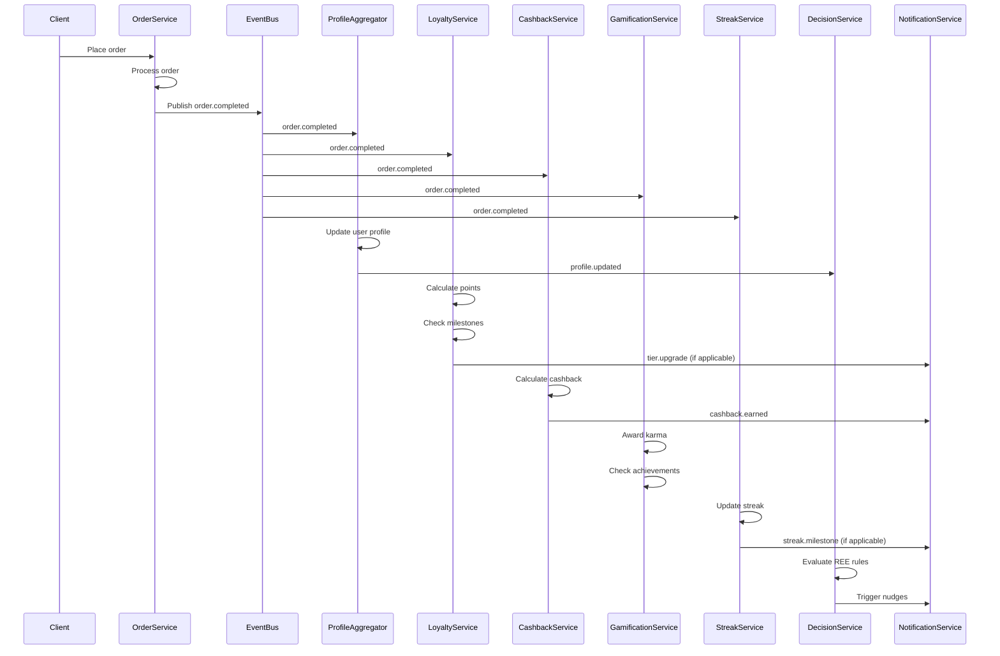

**Step-by-step flow:**

1. **Order completed** - User completes a transaction
2. **Publish `order.completed` event** - Order Service publishes to event bus
3. **Profile Aggregator receives** - Updates unified user profile
4. **Triggers cascade:**
   - **Loyalty Service**: Credit points, check tier progress
   - **Cashback Service**: Calculate and credit cashback
   - **Gamification Service**: Award karma points, achievements
   - **Streak Service**: Update daily streak counter
5. **All updates published** - Services emit their own events

---

### Karma → Loyalty Bridge

Karma points earned through engagement are periodically converted to loyalty points.

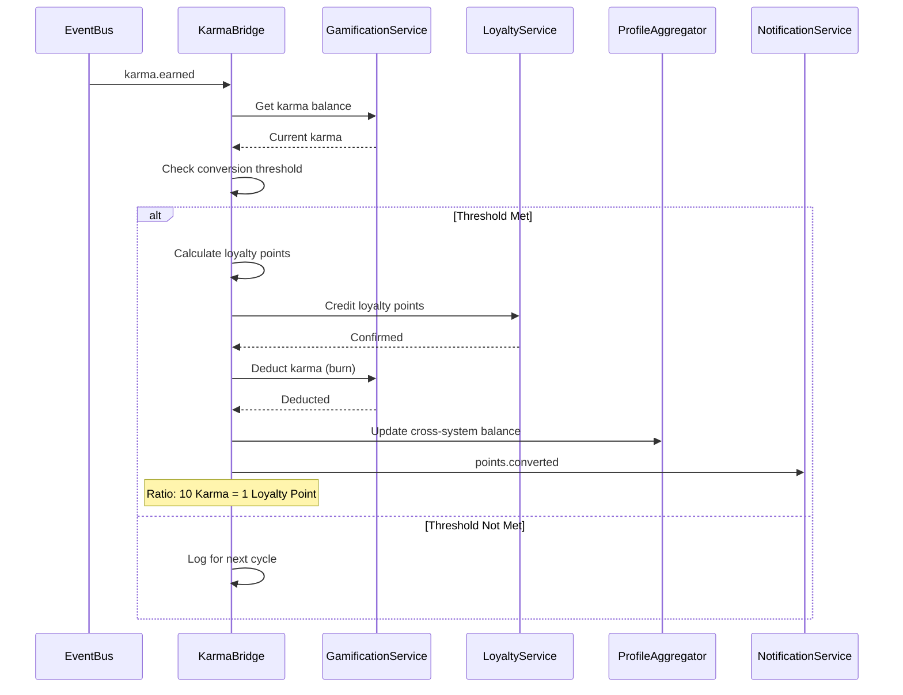

**Conversion Rules:**
- **Threshold**: 100 karma points minimum
- **Ratio**: 10 Karma = 1 Loyalty Point
- **Frequency**: Hourly batch processing
- **Cap**: Maximum 10,000 karma converted per day per user

---

### Intent → Dormant Revival

Dormant purchase intents are detected and revived through targeted nudges.

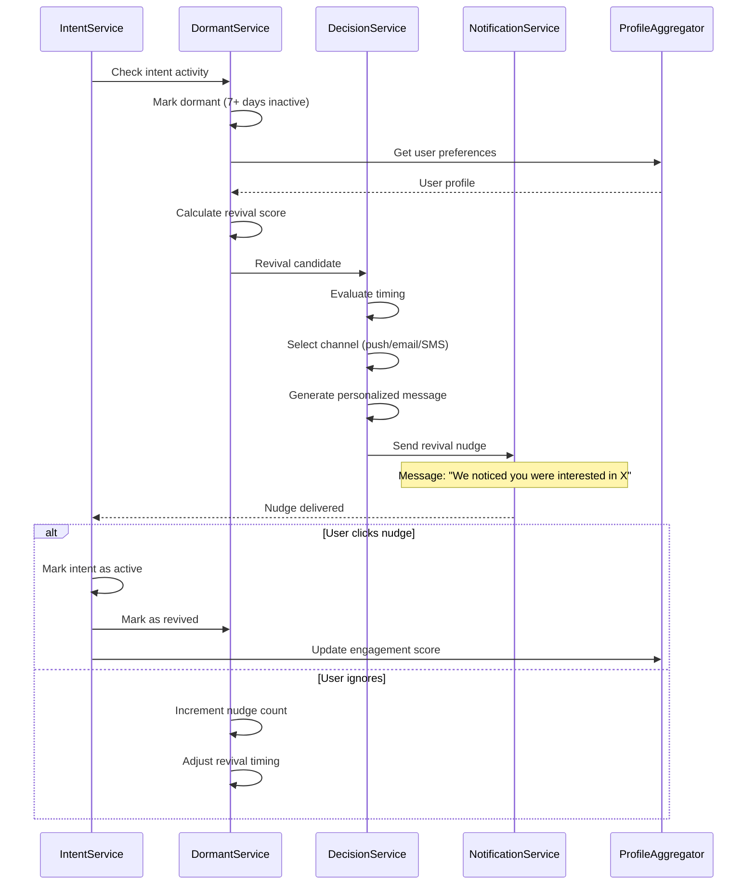

---

### Payment → Cashback

Payment confirmation triggers cashback calculation and crediting.

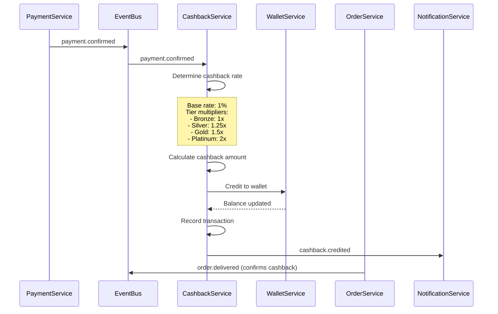

---

### Streak → Rewards

Daily engagement streaks unlock bonus rewards.

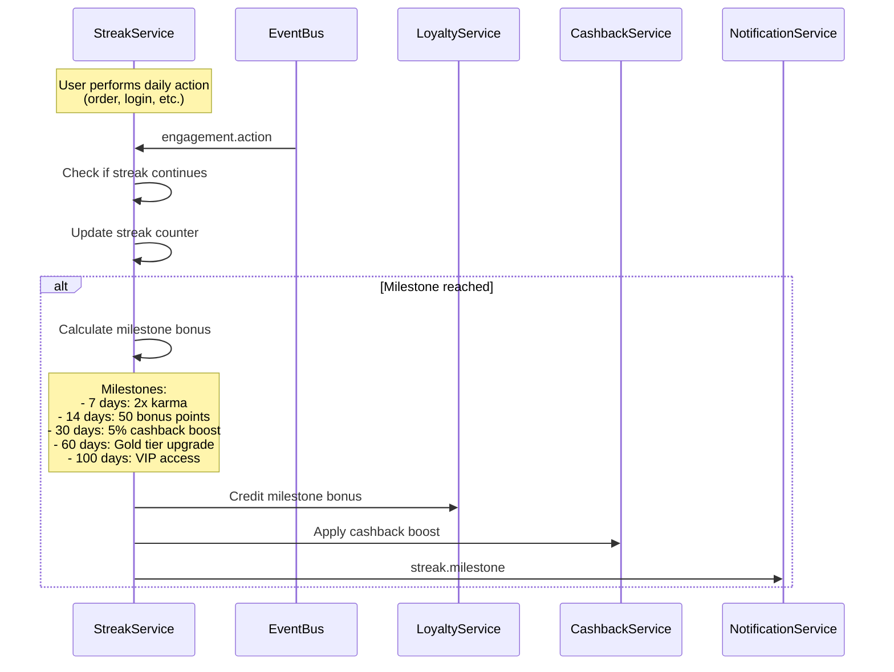

---

### Profile Aggregator → All Services

The Profile Aggregator maintains the single source of truth for user data.

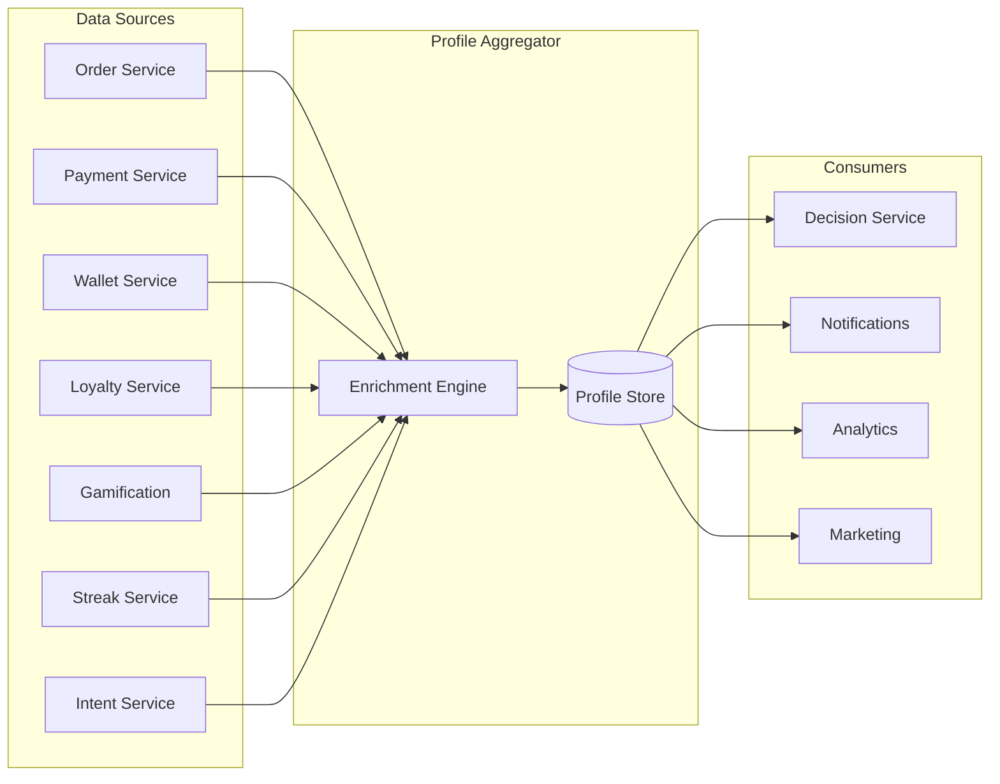

**Profile Data Flow:**

| Source | Data Provided | Update Frequency |
|--------|---------------|------------------|
| Order Service | Total orders, spend, categories | Real-time |
| Payment Service | Payment methods, success rate | Real-time |
| Wallet Service | Balance, transaction history | Real-time |
| Loyalty Service | Points, tier, milestones | Real-time |
| Gamification | Karma score, achievements | Batch (hourly) |
| Streak Service | Current streak, longest streak | Real-time |
| Intent Service | Active intents, dormant intents | Real-time |

---

### Decision Service → REE Rules

The Decision Service evaluates REE (Real-time Event Engine) rules to determine actions.

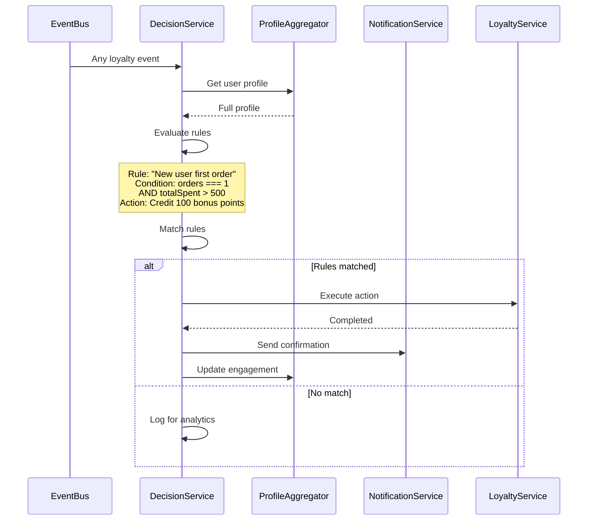

---

### Webhook Integrations

External systems integrate via webhooks for specific events.

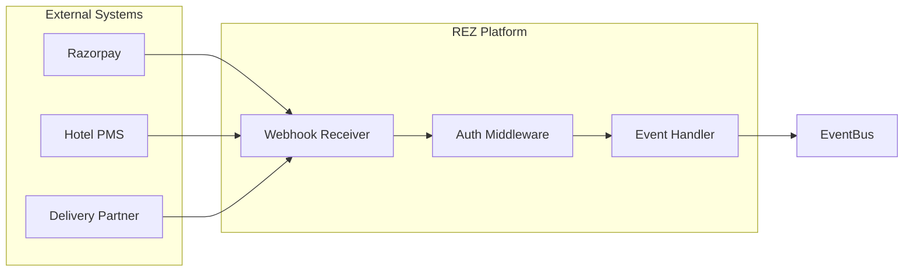

**Webhook Events:**

| Source | Event | Action |
|--------|-------|--------|
| Razorpay | `payment.success` | Confirm order, credit cashback |
| Razorpay | `payment.failed` | Mark order failed, release hold |
| Hotel PMS | `checkout` | Trigger review request |
| Delivery | `delivered` | Mark order complete, update loyalty |

---

## Cross-Service Event Flows

### New User Onboarding

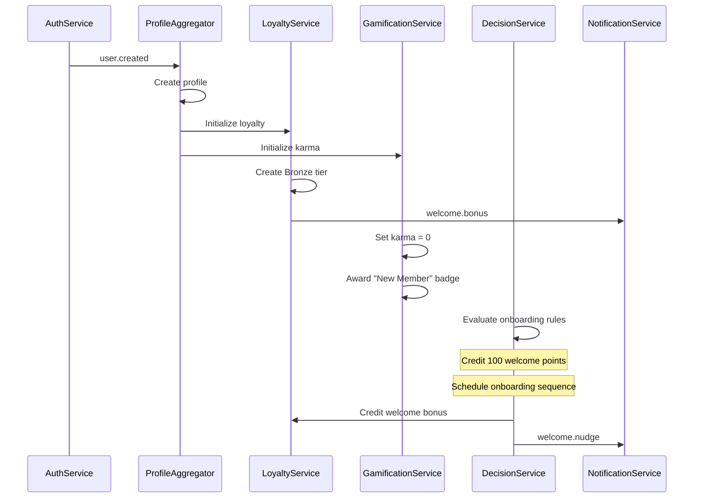

### Tier Upgrade

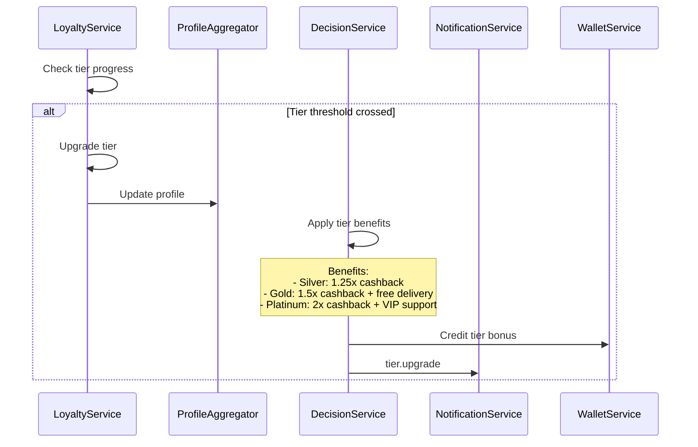

### Order Cancellation with Refund

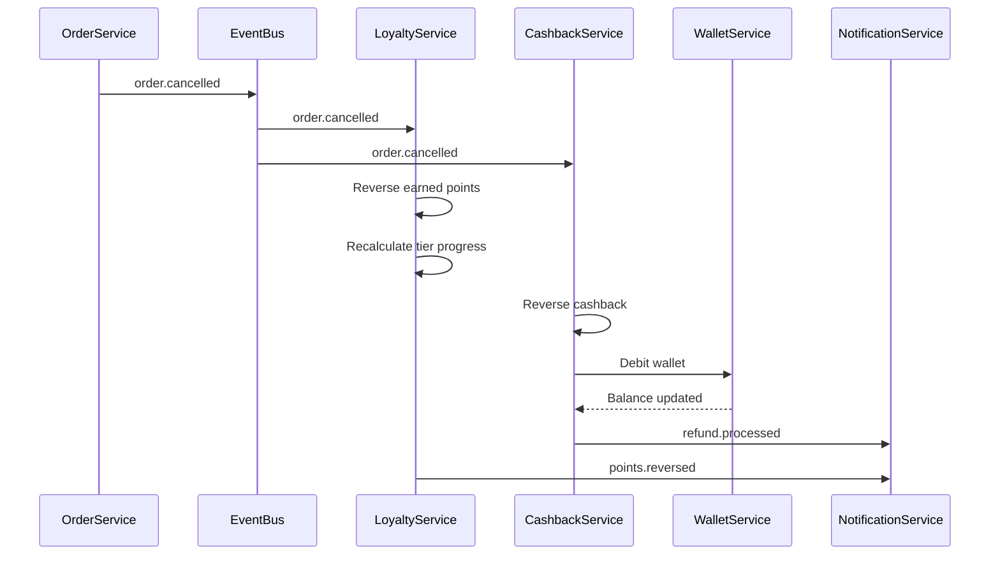

---

## Error Handling

### Retry Strategy

| Error Type | Retry | Backoff |
|------------|-------|---------|
| Network timeout | 3 times | Exponential (1s, 2s, 4s) |
| Service unavailable | 5 times | Exponential (1s, 2s, 4s, 8s, 16s) |
| Validation error | No retry | Immediate failure |
| Rate limited | 3 times | Linear (30s, 60s, 90s) |

### Dead Letter Queue

Failed events after max retries go to DLQ for manual review:

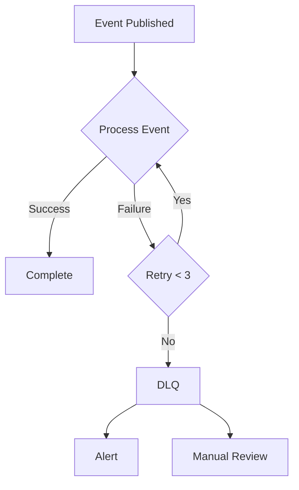

---

## Configuration

### Service URL Configuration

All service URLs are centralized in `src/config/services.ts`:

```typescript
export const SERVICE_URLS = {
  // Core Services
  wallet:       process.env.WALLET_SERVICE_URL,
  order:        process.env.ORDER_SERVICE_URL,
  payment:      process.env.PAYMENT_SERVICE_URL,
  merchant:     process.env.MERCHANT_SERVICE_URL,

  // Loyalty & Gamification
  gamification: process.env.GAMIFICATION_SERVICE_URL,
  loyalty:      process.env.LOYALTY_SERVICE_URL,
  cashback:     process.env.CASHBACK_SERVICE_URL,
  streak:       process.env.STREAK_SERVICE_URL,

  // Intelligence
  intent:       process.env.INTENT_SERVICE_URL,
  decision:     process.env.DECISION_SERVICE_URL,

  // Support
  notification: process.env.NOTIFICATION_SERVICE_URL,
  auth:         process.env.AUTH_SERVICE_URL,
} as const;
```

### Environment Variables

```bash
# Service URLs
WALLET_SERVICE_URL=http://localhost:4004
ORDER_SERVICE_URL=http://localhost:4006
PAYMENT_SERVICE_URL=http://localhost:4002
MERCHANT_SERVICE_URL=http://localhost:4003
NOTIFICATION_SERVICE_URL=http://localhost:4005
AUTH_SERVICE_URL=http://localhost:4001
CATALOG_SERVICE_URL=http://localhost:4007
SEARCH_SERVICE_URL=http://localhost:4008
MARKETING_SERVICE_URL=http://localhost:4009
GAMIFICATION_SERVICE_URL=http://localhost:4010
ADS_SERVICE_URL=http://localhost:4011
PMS_SERVICE_URL=http://localhost:4012
ANALYTICS_SERVICE_URL=http://localhost:4013
INSIGHTS_SERVICE_URL=http://localhost:4014
LOYALTY_SERVICE_URL=http://localhost:4016
CASHBACK_SERVICE_URL=http://localhost:4017
STREAK_SERVICE_URL=http://localhost:4018
KARMABRIDGE_SERVICE_URL=http://localhost:4019

# Internal Auth
INTERNAL_SERVICE_TOKEN=your-secure-token

# Database
MONGODB_URI=mongodb://localhost:27017
REDIS_URL=redis://localhost:6379
```

---

## Testing Integrations

### Simulate Order Completion

```bash
curl -X POST http://localhost:4006/api/orders \
  -H "Content-Type: application/json" \
  -H "X-Internal-Token: your-token" \
  -d '{
    "userId": "user123",
    "items": [{"productId": "prod1", "quantity": 2, "price": 100}],
    "total": 200
  }'
```

### Check Profile Updates

```bash
curl http://localhost:4015/api/profile/user123 \
  -H "X-Internal-Token: your-token"
```

### Verify Loyalty Credit

```bash
curl http://localhost:4016/api/loyalty/user123/balance \
  -H "X-Internal-Token: your-token"
```

---

*For complete event schemas, see [EVENTS.md](EVENTS.md)*
*For REE decision rules, see [DECISIONS.md](DECISIONS.md)*
